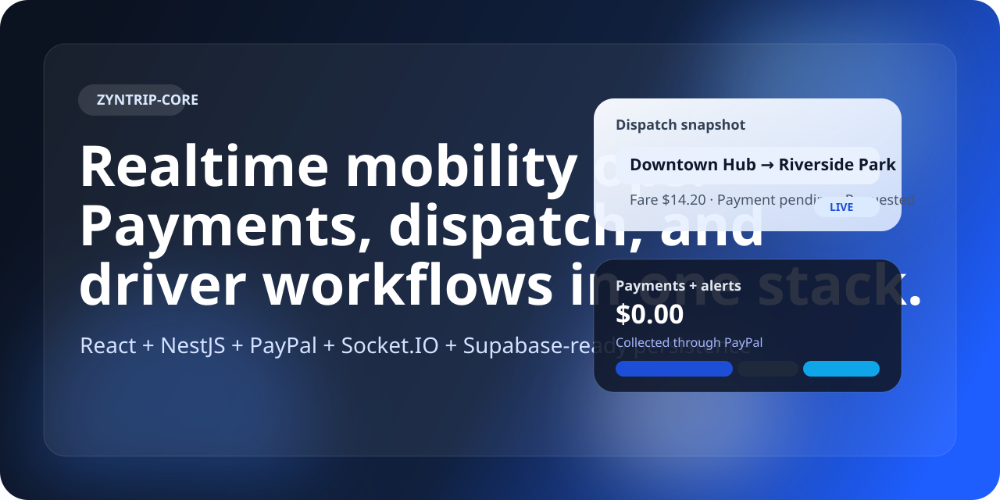
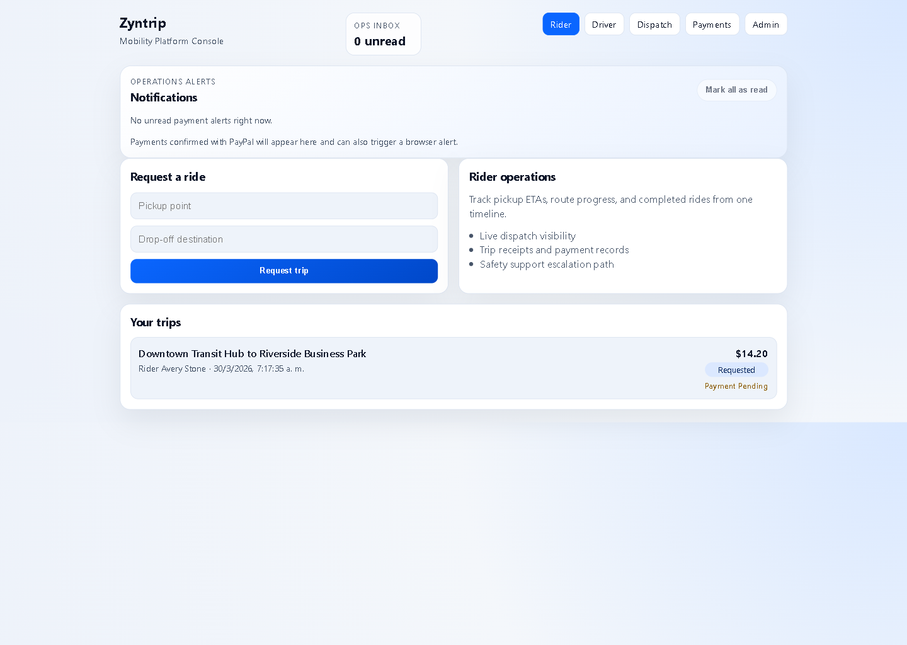
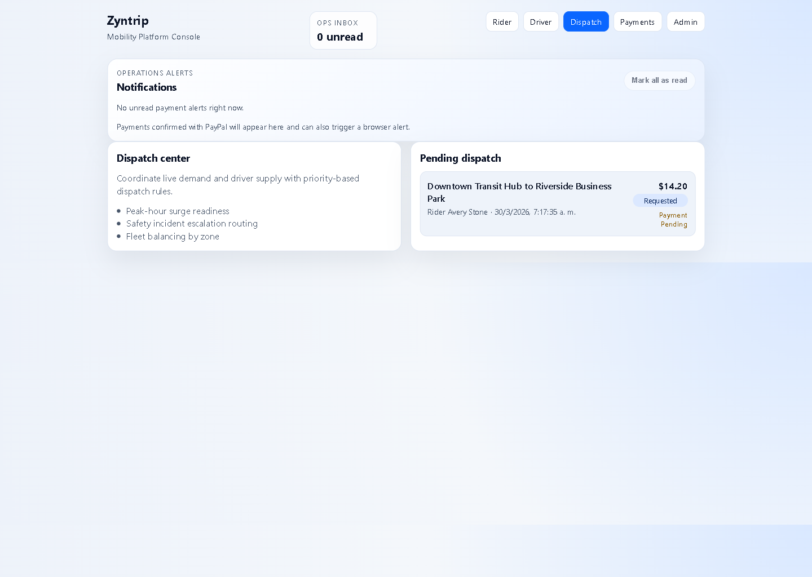
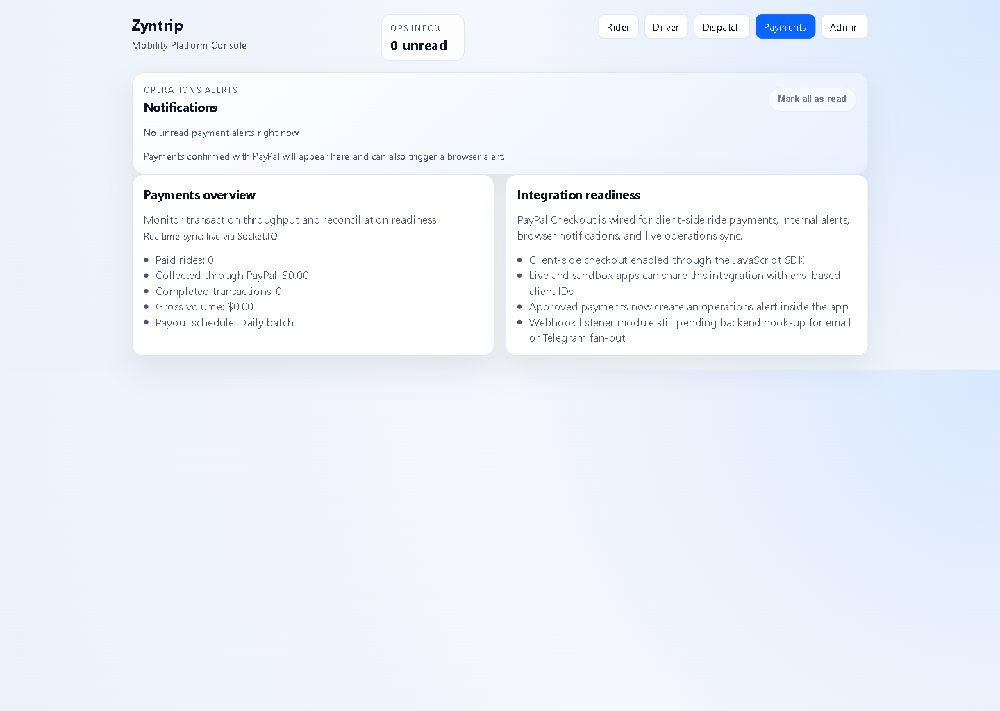

# Zyntrip Core



[](https://react.dev/)
[](https://nestjs.com/)
[](https://developer.paypal.com/)
[](https://socket.io/)
[](https://supabase.com/)
[](https://www.typescriptlang.org/)

Zyntrip Core is a full-stack ride operations platform built in public for riders, drivers, dispatch teams, and finance operators.

It combines a React frontend, a NestJS backend, PayPal checkout, and Socket.IO realtime flows so the product can move beyond static dashboards into live trip and payment operations.

## What Works Today

- Rider trip requests with fare estimation
- Driver queue actions for accept, start, complete, and decline
- Dispatch and trip timeline views
- PayPal checkout in the rider flow
- In-app and browser payment notifications
- Socket.IO realtime updates for trips and operations alerts
- Supabase-ready backend persistence with in-memory fallback for local development

## Why This Repo Exists

This repository is the product core for a modern mobility stack:

- frontend for daily operations
- backend for business logic and payments
- realtime transport for live status changes
- persistence layer ready for Supabase/Postgres

The goal is to ship an opinionated, production-minded base that can grow into a serious transportation or field-operations platform.

## Screenshots

<p align="center">
  
  
  
</p>

Local captures from the current build showing the rider flow, dispatch view, and payments console.

## Stack

- React 18
- TypeScript
- Vite 6
- React Router DOM
- Socket.IO client
- CSS tokens with modular feature architecture

## Product Modules

- Authentication: login and registration flows with role-based session routing
- Rider Console: ride request flow and personal trip timeline
- Driver Console: request queue with accept/decline/start/complete actions
- Dispatch Board: pending trip visibility for operations coordination
- Payments Console: settlement metrics and integration-ready payment layer
- Admin Dashboard: platform KPIs and operational status

## Project Structure

```text
backend/
  src/
    auth/
    health/
    notifications/
    payments/
    realtime/
    trips/
    app.module.ts
    main.ts
src/
  app/
    providers/
    App.tsx
    router.tsx
  components/
    layout/
    ui/
  features/
    auth/
    riders/
    drivers/
    trips/
    dispatch/
    payments/
    admin/
  services/
  hooks/
  lib/
  assets/
  styles/
```

## Getting Started

1. Install dependencies:

```bash
npm install
```

2. Start the development server:

```bash
npm run dev
```

3. Start the backend API:

```bash
npm run dev:backend
```

4. Build production assets:

```bash
npm run build
```

5. Build the backend:

```bash
npm run build:backend
```

## PayPal Setup

This project includes a base PayPal Checkout integration for ride payments.

1. Copy `.env.example` values into your local environment.
2. Set `VITE_PAYPAL_CLIENT_ID` with the sandbox or live client ID from your PayPal app.
3. Start the app and create a ride from the rider dashboard to test the checkout flow.

Current integration scope:

- PayPal JavaScript SDK for client-side checkout buttons
- Ride payment capture flow on the rider dashboard
- Paid/pending/failed payment state reflected in the trips store
- Payments overview page wired to PayPal-driven trip totals
- In-app operations inbox plus browser notifications for approved payments
- Socket.IO live sync for trips, payment state, and operations alerts

Production hardening still recommended:

- server-side order creation and capture verification
- webhook listener for payment reconciliation
- outbound notification fan-out to email, Telegram, or Slack from the webhook handler
- secure secret storage outside the frontend

## Backend API

The repo now includes a NestJS backend scaffold in `backend/` so the frontend can move off in-memory mocks without leaving this project structure.

Included modules:

- `health`: readiness check at `GET /api/health`
- `auth`: starter endpoints for `POST /api/auth/register` and `POST /api/auth/login`
- `trips`: starter endpoints for `GET /api/trips`, `POST /api/trips`, and `PATCH /api/trips/:tripId/payment/paid`
- `realtime`: Socket.IO gateway for `trip.created`, `trip.updated`, and `notification.created`
- `payments`: starter endpoints for `POST /api/payments/paypal/orders` and `POST /api/payments/paypal/webhook`
- `notifications`: server-side handoff point for Telegram, email, or Slack alerts

Environment variables for the backend live in `backend/.env.example`.

Current backend scope:

- NestJS API shell with validation and CORS
- Supabase server client with safe in-memory fallback when credentials are missing
- starter Postgres schema in `backend/supabase/migrations/001_initial_schema.sql`
- PayPal order and webhook stubs in the correct backend layer
- notification fan-out stub that can be wired to Telegram or email next
- live trip and notification fan-out over Socket.IO for the frontend

To enable Supabase persistence:

1. Create a Supabase project.
2. Apply `backend/supabase/migrations/001_initial_schema.sql` in the SQL editor.
3. Copy `backend/.env.example` to `backend/.env`.
4. Fill `SUPABASE_URL` and `SUPABASE_SERVICE_ROLE_KEY`.
5. Restart `npm run dev:backend`.

## Backend Readiness and Suggested Architecture

- API Layer: NestJS (or FastAPI) with domain modules: auth, riders, drivers, trips, dispatch, payments, admin
- Database: PostgreSQL with Supabase or Neon
- Messaging: Redis streams or RabbitMQ for dispatch and trip event orchestration
- Auth: JWT + refresh token strategy with RBAC for rider/driver/dispatcher/admin roles
- Payments: Stripe Connect for rider payments and driver payouts
- Deployment: AWS EC2 with Docker + Nginx reverse proxy, or containerized ECS/Fargate as scale grows

## Roadmap

- Geospatial search and ETA estimation
- Dynamic pricing and surge zones
- Driver onboarding workflow and compliance checks
- Full payment lifecycle with webhooks and reconciliation
- Observability stack (OpenTelemetry, logs, metrics, tracing)
